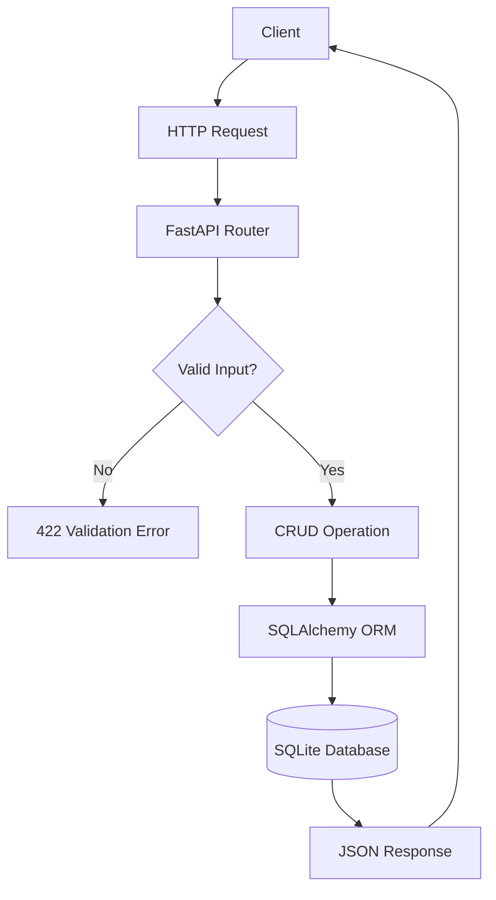

# Student Management REST API

A complete RESTful API built with **FastAPI, SQLite, SQLAlchemy, and Pydantic**.

> All records in this project are fictional sample data. No personal/user data is used.

## Features

- Full CRUD operations
- SQLite database integration
- SQLAlchemy ORM
- Pydantic input validation
- Email validation
- Year and CGPA range validation
- Duplicate email protection
- 404 and 409 error handling
- JSON responses
- Automatic Swagger/OpenAPI documentation
- ReDoc documentation
- Automated tests
- Vercel Python deployment configuration

## Project Structure

```text
student-management-rest-api/
├── app/
│   ├── main.py
│   ├── database.py
│   ├── models.py
│   ├── schemas.py
│   └── routers/students.py
├── api/index.py
├── tests/test_students.py
├── requirements.txt
├── vercel.json
└── README.md
```

## Data Model

| Field | Type | Rules |
|---|---|---|
| id | Integer | Primary key |
| name | String | 2-100 characters |
| email | Email | Required, unique |
| department | String | 2-100 characters |
| year | Integer | 1-4 |
| cgpa | Float | 0-10 |

## Endpoints

| Method | Endpoint | Description |
|---|---|---|
| POST | `/students` | Create student |
| GET | `/students` | List students |
| GET | `/students/{id}` | Get one student |
| PUT | `/students/{id}` | Update student |
| DELETE | `/students/{id}` | Delete student |
| GET | `/health` | Health check |
| GET | `/docs` | Swagger UI |
| GET | `/redoc` | ReDoc |

## Sample Data

```json
{
  "name": "Rahul Kumar",
  "email": "rahul.kumar@example.com",
  "department": "Computer Science",
  "year": 2,
  "cgpa": 8.4
}
```

## Run Locally

```bash
python -m venv .venv
```

Windows:

```bash
.venv\Scripts\activate
```

Linux/macOS:

```bash
source .venv/bin/activate
```

Install:

```bash
pip install -r requirements.txt
```

Run:

```bash
uvicorn app.main:app --reload
```

Open:

- http://127.0.0.1:8000/docs
- http://127.0.0.1:8000/redoc

## Example Request

```bash
curl -X POST "http://127.0.0.1:8000/students" ^
  -H "Content-Type: application/json" ^
  -d "{"name":"Meera Nair","email":"meera.nair@example.com","department":"Civil Engineering","year":2,"cgpa":8.2}"
```

## Example Error

```json
{
  "detail": "Student with ID 999999 not found"
}
```

## Flowchart



## Testing

```bash
pytest -q
```

## API Documentation

FastAPI automatically generates:

- Swagger UI: `/docs`
- ReDoc: `/redoc`
- OpenAPI specification: `/openapi.json`
